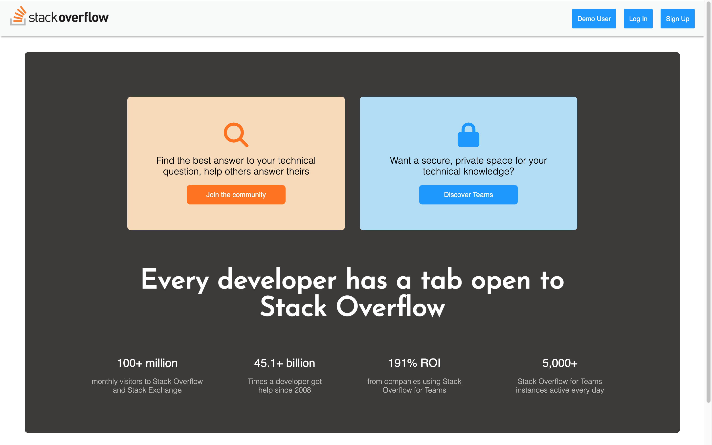
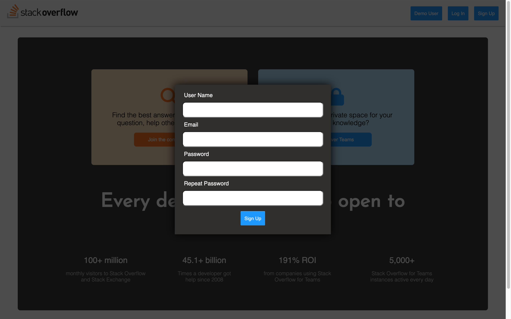
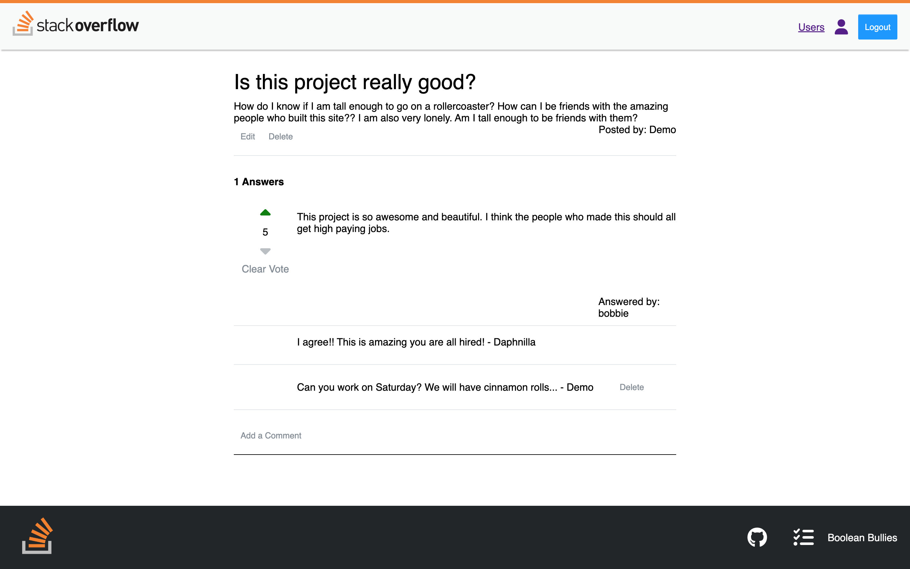

# **StackOverflow Clone**
Welcome to our **StackOverflow** clone created by the Boolean Bullies! This is a clone of our industry site where people can go and ask questions, answer questions, make comments, and up-vote or down-vote answers. Checkout our live site at [https://stackoverflow-bb.herokuapp.com/](https://stackoverflow-bb.herokuapp.com/)

**Contributors**:
- [Ellie Billerbeck](https://github.com/elnorabills)
- [Isaac Darzi](https://github.com/gitCommitted)
- [Keith Glines](https://github.com/Kglines)
- [Scotty Wong](https://github.com/scottywong)

## **Technologies Used**
For this project, we used the following technologies:
- **Backend**
    - Python
    - Flask
    - WTForms
    - SQLAlchemy
    - Alembic
- **Frontend**
    - Javascript
    - React
    - React-Router
    - React-Redux
    - CSS

## To get started on your local environment

1. Clone the repo and run `pipenv install` to install the dependencies
2. run `pipenv run flask run` to get the backend started.
3. cd into the `reaact-app`
4. run `npm install` to install the frontend dependencies
5. run `npm start` to start the frontend
6. go to [localhost:3000](localhost:3000) in your browser

## **Screen Shots**
### Landing Page


### Sign up Modal


### Question Detail Page


## Features
- Signup
- Login
- Demo user with full functionality
- View all Questions
- View only your Questions and your Answers
- Answer any Question you didn't ask
- Vote on any Answer
- Comment on Any Answer
- Update or Delete only a Question that you asked
- Update or Delete only an Answer you posted
- Delete any comment you made
- Clear your vote and re-vote

## Future additions
- Search bar to search questions
- Add categories for questions based on topics
<!-- 
### Backend Routes
Prepend all routes below with /api

### /auth/login
POST credentials for authentication

### /auth/signup
POST create new user

### /auth/logout
DELETE user session

### /users/questions
GET my questions

Require Authentication: TRUE

Request Body:
N/A

Response Body
Status Code: 200

Require Authentication: TRUE

```
{
    "Questions" :
    [
        {
            "id": 1,
            "userId": 1,
            "username": "demo",
            "title": "Sample Title",
            "body": "Sample Body",
            "created_on":  "2022-12-12", 
            "last_update_on": "2022-12-12"
        },
        {
            "id": 2,
            "userId": 1,
            "username": "demo",
            "title": "Sample Title",
            "body": "Sample Body",
            "created_on":  "2022-12-12", 
            "last_update_on": "2022-12-12"
        }
    ]
}  
```

### /users/answers
GET my answers

Require Authentication: TRUE

Request Body:
N/A

Response Body

Status Code: 200

Require Authentication: TRUE
```
{
    "Answers" :
    [
        {
            "id": 1,
            "userId": 1,
            "username": "demo",
            "questionId":1,
            "body": "Sample Body",
            "created_on":  "2022-12-12", 
            "last_update_on": "2022-12-12"
        },
        {
            "id": 2,
            "userId": 1,
            "username": "demo",
            "questionId":1,
            "body": "Sample Body",
            "created_on":  "2022-12-12", 
            "last_update_on": "2022-12-12"
        }
    ]
}
```                                         

### /questions
GET all questions

Require Authentication: TRUE

Request Body:
N/A

Response Body

Status Code: 200

```
{
    "Questions" :
    [
        {
            "id": 1,
            "userId": 1,
            "username": "demo",
            "title": "Sample Title",
            "body": "Sample Body",
            "created_on":  "2022-12-12", 
            "last_update_on": "2022-12-12"
        },
        {
            "id": 2,
            "userId": 2,
            "username": "demo",
            "title": "Sample Title",
            "body": "Sample Body",
            "created_on":  "2022-12-12", 
            "last_update_on": "2022-12-12"
        }
    ]
}
```

### /questions
POST a new question

Require Authentication: TRUE

Request Body
```
{
    "title": "Sample Title",
    "body": "Sample Body"
}
```

Response Body

Status Code: 201

```
{
    "id": 2,
    "userId": 2,
    "username": "demo",
    "title": "Sample Title",
    "body": "Sample Body",
    "created_on":  "2022-12-12", 
    "last_update_on": "2022-12-12"
}
```

 ### /questions/:questionId
GET a specific question and it's associated answers, cumulative votes, and comments

Require Authentication: TRUE

Response Body

Status Code: 200

```
{
    "Question" :
    {
        "id": 1,
        "userId": 1,
        "username": "demo",
        "title": "Sample Title",
        "body": "Sample Body",
        "created_on":  "2022-12-12", 
        "last_update_on": "2022-12-12",
        "Answers" :
        [
            {
                "id": 1,
                "userId": 1,
                "username": "demo",
                "questionId":1,
                "body": "Sample Body",
                "created_on":  "2022-12-12", 
                "last_update_on": "2022-12-12",
                "Comments": 
                [
                    {
                        "id": 1,
                        "userId": 1,
                        "username": "demo",
                        "answerId": 1,
                        "body": "Sample Body"
                    },
                    {
                        "id": 2,
                        "userId": "1",
                        "username": "demo",
                        "answerId": "1",
                        "body": "Sample Body"
                    }
                ],
                "Votes": 
                {
                    "hasVoted" : false,
                    "total" : -1,
                    "voteId" : Null
                }
            }
        ]
    }
}  
```    

### /questions/:questionId
PUT to update a specific question

Require Authentication: TRUE

Request Body

```
{
    "title": "Sample Title",
    "body": "Sample Body"
}
```

Response Body

Status Code: 200

Require Authentication: TRUE

```
{
    "id": 2,
    "userId": 2,
    "username": "demo",
    "title": "Sample Title",
    "body": "Sample Body",
    "created_on":  "2022-12-12", 
    "last_update_on": "2022-12-12"
}
```

### /questions/:questionId
DELETE a specific question

Require Authentication: TRUE

Request Body:
N/A

Response Body

Status Code: 200

```
{
    "message": "Successfully deleted",
    "Status Code": 200
    
}
```

### /questions/:questionId/answers
POST a new answer

Require Authentication: TRUE

Request Body
```
{
    "body": "Sample Body"
}
```

Response Body

Status Code: 201

```
{
    "id": 2,
    "userId": 2,
    "username": "demo",
    "questionId": 1,
    "body": "Sample Body",
    "created_on":  "2022-12-12", 
    "last_update_on": "2022-12-12"
}
```

### /answers/:answerId
PUT to update a specific answer

Require Authentication: TRUE

Request Body

```
{
    "body": "Sample Body"
}
```

Response Body

Status Code: 200

```
{
    "id": 2,
    "userId": 2,
    "username": "demo",
    "questionId": 1,
    "body": "Sample Body",
    "created_on":  "2022-12-12", 
    "last_update_on": "2022-12-12"
}
```

### /answers/:answerId

DELETE a specific answer

Require Authentication: TRUE

Request Body
N/A

Response Body

Status Code: 200

```
{
    "message": "Delete Successfully",
    "Status Code": 200
}
```

### /answers/:answerId/comments

POST a new comment

Require Authentication: TRUE

Request Body
```
{
    "body": "Sample Body"
}
```

Response Body

Status Code: 200

```
{
    "id": 2,
    "userId": 2,
    "username": "demo",
    "answerId": 1,
    "body": "Sample Body",
    "created_on":  "2022-12-12", 
    "last_update_on": "2022-12-12"
}
```

### /comments/:commentId

PUT to update a specific comment

Require Authentication: TRUE

Request Body
```
{
    "body": "Sample Body"
}

```

Response Body

Status Code: 200
```
{
    "id": 2,
    "userId": 2,
    "username": "demo",
    "answerId": 1,
    "body": "Sample Body",
    "created_on":  "2022-12-12", 
    "last_update_on": "2022-12-12"
}
```

### /comments/:commentId

DELETE a specific comment

Require Authentication: TRUE

Request Body
N/A

Response Body
Status Code: 200

```
{
    "message": "Delete Successfully",
    "Status Code": 200
}
```

### /answers/:answerId/votes

POST a vote direction for a specific user on a specific answer

Require Authentication: TRUE

Request Body

```
{
    "voteDirection": 'Up'
}
```

Response Body

Status Code: 200

```
{
    "id": 2,
    "userId": 2,
    "answerId": 1,
    "voteDirection": "Down"
}
    
```
### /votes/:voteId
DELETE a specific vote

Require Authentication: TRUE

Request Body:
N/A

Response Body

Status Code: 200

```
{
    "message": "Successfully deleted",
    "Status Code": 200
    
}
``` -->

